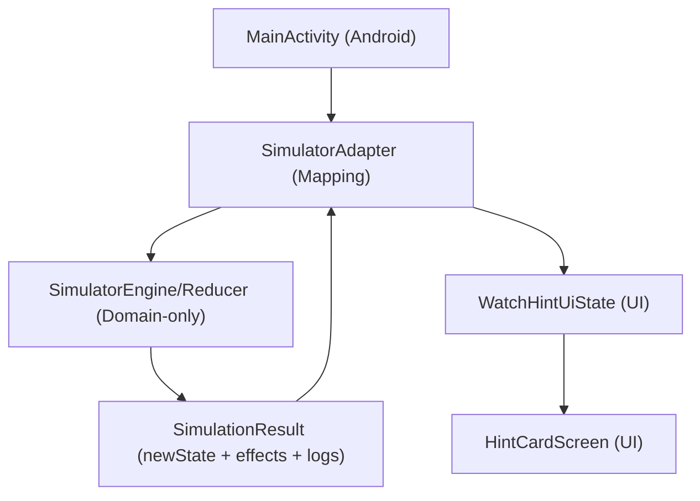

# Architecture Simulator - Bestandsaufnahme (Phase 1)

## 0) Kontext
Ziel des späteren *Architecture Simulator* ist es, fachliche App-Abläufe (Projektstart, Aufnahme, Foto/Marker, Transkript-Events, Checklisten-Checks, KI-Auswertung, Exportpipeline, Fehler-/Retry-Fälle, Offline/Online/Hybrid) als **Zustände, Events und Outputs** modellierbar und testbar zu machen.

Im aktuellen Workspace existiert als produktiver Code jedoch nur ein minimales Wear-OS UI-Gerüst für „Hints“.

## 1) Aktueller Projektbestand

### 1.1 Module / Struktur
- Projektroot: `c:\code\brainpillar`
- Android-Modul(e):
  - `:app-watch`
- Es existiert aktuell **kein** „mobile“/„backend“/„shared“-Modul im Workspace.
- Es existiert aktuell **kein** `docs/`-Ordnerinhalt und **keine** Testmodule (`src/test`, `src/androidTest`) im `app-watch` Modul.

### 1.2 Watch-Startpunkt
- Entry Activity:
  - `c:\code\brainpillar\app-watch\src\main\java\com\brainpillar\watch\MainActivity.kt`
- In `MainActivity` wird direkt ein statischer Demo-State gerendert:
  - `HintCardScreen(state = WatchHintUiState.Content(...))`

### 1.3 Existierende „Hint“-Domänen-/UI-Schicht
#### Datenmodell
- `c:\code\brainpillar\app-watch\src\main\java\com\brainpillar\watch\feature\hints\model\WatchHintModel.kt`
  - `HintType` (PERSON, TOPIC, REMINDER, FALLBACK)
  - `ConfidenceLabel` (PROBABLE, POSSIBLE)
  - `WatchHintModel` (title/subtitle, stale-Flag, optional timestamp)

#### UI-State/„Zustandsmodell“
- `c:\code\brainpillar\app-watch\src\main\java\com\brainpillar\watch\feature\hints\model\WatchHintUiState.kt`
  - `Loading`
  - `Content(hint: WatchHintModel)`
  - `Empty`
  - `Error(message)`

#### UI Komponenten
- `c:\code\brainpillar\app-watch\src\main\java\com\brainpillar\watch\feature\hints\ui\HintIcon.kt`
- `c:\code\brainpillar\app-watch\src\main\java\com\brainpillar\watch\feature\hints\ui\HintCard.kt`
- `c:\code\brainpillar\app-watch\src\main\java\com\brainpillar\watch\feature\hints\ui\HintCardScreen.kt`
  - Render-Logik via `when (state)` (kein Navigation/kein ViewModel)
  - Wear-typische „calm dark“ UI und runde Screen-sichere insets.

## 2) Existierende Features vs. gewünschte Simulator-Ziele

### 2.1 Vorhanden
- Nur ein UI-flow: Hint Card Screen.
- Ein sehr kleines Zustandsmodell (`WatchHintUiState`) für das Rendern eines einzelnen Hints.

### 2.2 Nicht vorhanden im aktuellen Workspace
Für die Simulator-Scope (fachliche Abläufe) fehlt aktuell:
- Session-/Recording-State
- Photoaufnahme/Marker-Flow
- Live-Transkriptionspipeline (Events/Chunking)
- KI-Summary-/Auswertungslogik
- Settings-/Modell-Konfiguration
- Exportpipeline und deren Status/Fehlerfälle
- Tests und/oder zentrale Coordinator-/Manager-Schichten

Das bedeutet: Der „Architecture Simulator“ kann hier zunächst nur **als interne, fachliche Orchestrierungsschicht** entstehen, die später an die echten App-Komponenten adaptiert wird.

## 3) Kopplungen / Testbarkeit (Ist-Zustand)

### 3.1 Kopplungen
- `MainActivity` gekoppelt direkt an UI-Komponente:
  - produziert bzw. hält den UI-State statisch und übergibt ihn an `HintCardScreen`.
- Die „State“-Komponente (`WatchHintUiState`) ist zwar sauber als sealed interface, ist aber primär UI-orientiert (Anzeige-/Renderzustand), nicht Prozess-/Workflow-orientiert.

### 3.2 Testbarkeit
- Aktuell gibt es keinen reinen Reducer/Engine-Code, der als Unit-Tests ohne Android-Framework laufen könnte.
- UI-Komponenten enthalten nur lokale Logik (Text-Präfix bei `ConfidenceLabel`, stale Text, etc.), keine großen Übergänge.

## 4) Gute Einstiegspunkte für eine Simulator-Orchestrierungsschicht

Da aktuell keine Prozesslogik existiert, ist der konservativste Einstieg:
- **zwischen** `MainActivity` und `HintCardScreen` einen Adapter zu legen:
  - Simulator produziert SimulatorState/Outputs (rein fachlich)
  - Adapter mappt Outputs minimal auf `WatchHintUiState`

Konzeptueller Datenfluss (später):

## 5) Risiken / Annahmen für Phase 3+
- Annahme: Der „Architecture Simulator“ wird initial **rein additiv** eingeführt (neues Package), ohne bestehende Produktionslogik zu ersetzen.
- Da bisher kein Session/Recording existiert, werden die Simulator-States/Events zunächst „abstrakt“ modelliert (z. B. Start/Recording/Pause/Finish) und später via Adapter an echte Datenquellen angebunden.
- Ziel ist, die Transition-/Validation-Logik vollständig Android-frei zu halten, um Unit-Tests zu ermöglichen.

## 6) Zusammenfassung (für den nächsten Schritt)
Im aktuellen Workspace ist nur ein minimales Hint-UI-Gerüst vorhanden. Es gibt keine zentralen Coordinator-/Manager-/Repository-Schichten und keine fachliche Workflow-Logik.

Daraus folgt:
- Phase 1+2 sollte die Simulator-Grenzen und Verträge (State/Event/Effect/Output) als **neue, reine Domain-Schicht** definieren.
- Phase 3+4 implementiert zunächst einen minimalen Kern und bildet dann EINEN simplen Workflow rein modellierend ab, ohne bestehende Logik anzutasten.

