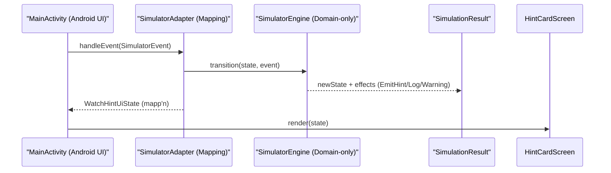

# Architecture Simulator - Zielarchitektur (Phase 2)

## 0) Zielsetzung
Der „Architecture Simulator“ ist primär eine **interne** Orchestrierungs-/Testschicht. Er modelliert fachliche App-Abläufe als:
- `SimulatorState` (was ist gerade „wahr“ im Ablauf?)
- `SimulatorEvent` (was passiert als nächstes?)
- `SimulatorEffect` / `SimulatorOutput` (welche Konsequenzen/Ausgaben entstehen?)

Wichtig: In dieser ersten Entwurfsphase steht die **Trennschärfe** im Vordergrund:
- Domain-/Reducer-Logik soll Android- und UI-frei sein (Unit-Tests ohne Framework).
- Android/Compose-Integration bleibt auf Adapter/Mapping begrenzt.

## 1) Abgrenzung: Was ist fachlich vs. Android/UI?

### 1.1 Rein fachlich (testbar ohne Android)
Die folgenden Teile sollen keine Android-/Compose-Abhängigkeiten haben:
- Zustandsmodell (`SimulatorState`)
- Eventmodell (`SimulatorEvent`)
- Transition/Validierungslogik (Reducer/Engine)
- Ausgabe-/Effect-Modell (`SimulatorEffect`)
- `SimulationResult` (State + Effekte + Logs + Warnings)

### 1.2 Android-/UI-abhängig (nur dünner Adapter)
Separat dazu kommt ein Adapter, der:
- Simulator-Outputs (Effects) in UI-konforme Strukturen mappt
- UI-Events (künftig z. B. „Debug-Trigger“) in `SimulatorEvent` übersetzt

Im aktuellen Workspace existiert UI nur als Hint-Screen:
- [`HintCardScreen`](c:\code\brainpillar\app-watch\src\main\java\com\brainpillar\watch\feature\hints\ui\HintCardScreen.kt)
- `WatchHintUiState` als reines Render-State

Der Architektur-Simulator wird daher zunächst „nur“ so weit integriert, dass er einen `WatchHintUiState` (Demo) liefern kann.

## 2) Minimaler Simulator-Core (Entwurf)

### 2.1 `SimulatorState`
Minimal, erweiterbar, und bewusst nicht zu detailliert für die ersten Iterationen.

Beispielhafte State-Bausteine:
- `stage`: Enum/Sealed (z. B. `Idle`, `ProjectRunning`, `RecordingActive`, `Paused`, `Completed`)
- `projectId` / `sessionId` (optional)
- Flags/Metadaten:
  - `isRecording`
  - `lastKnownNetwork` (später Offline/Online/Hybrid)
  - `lastError` (optional, nur fachlich als Wert)
- `history`: optional (für Logs oder Debug; im Core kann das als Liste von „AuditEvents“ geführt werden)

### 2.2 `SimulatorEvent`
Events sind explizit und „kommunikationsneutral“:
- `StartProject(projectId, timestampUtc)`
- `StartRecording(timestampUtc)`
- `PauseRecording(timestampUtc)`
- `ResumeRecording(timestampUtc)`
- `CapturePhoto(markerId?, segmentId?, timestampUtc)`
- `TranscriptionUpdated(chunkText, confidenceBand?, timestampUtc)`
- `ChecklistRequested(checklistId?, timestampUtc)` (später)
- `AiEvaluationRequested(mode?, timestampUtc)` (später)
- `FinishProject(timestampUtc)`
- `NetworkModeChanged(mode, timestampUtc)`
- `RetryRequested(reason, timestampUtc)`

### 2.3 `SimulatorEffect` / `SimulatorOutput`
Effekte beschreiben „was als Konsequenz passieren muss“, aber ohne konkrete Android-Implementierungen.

Empfohlene erste Effect-Typen:
- `Log(level, message)`
- `Warning(message)`
- `EmitHint( // fachliche Hint-Ausgabe für den Watch-Adapter
    hintType,
    title,
    subtitle,
    confidenceLabel?,
    isStale,
    ttlSec?
  )`

Später können Effekte erweitert werden um:
- `TriggerChecklistEvaluation(checklistId)`
- `TriggerAiEvaluation(mode)`
- `RequestExportPipeline(exportMode)`
- `StartTranscriptionPipeline(source)`

### 2.4 `SimulationResult`
`transition(...)` soll ein Ergebnis liefern, das neben dem neuen State auch Effekte und Diagnoseinfos enthält:
- `newState: SimulatorState`
- `effects: List<SimulatorEffect>`
- `logs: List<LogEntry>` (oder subset davon)
- `warnings: List<WarningEntry>`

### 2.5 `SimulatorEngine` / Reducer
Signatur (Entwurf):
- `fun transition(state: SimulatorState, event: SimulatorEvent): SimulationResult`

Regeln:
- Transition validiert Zustandskonsistenz.
- Ungültige Events sollen **keine** Statekorruption erzeugen.
- Bei ungültigen Events:
  - entweder unveränderten State + `Warning(...)`
  - oder spezielle `ErrorEffect(...)` (nur als Wert, keine Exceptions in Production)

## 3) Integration in bestehendes Watch-Modul (minimal)

Aktuell gibt es kein ViewModel/Navigator im Workspace; `MainActivity` rendert direkt `HintCardScreen`.

Für die spätere Phase 4 (Workflow-Abbildung) wird ein sehr kleiner Adapter benötigt, der:
- Simulator `EmitHint(...)` Effects nimmt
- daraus `WatchHintModel` erstellt
- daraus `WatchHintUiState.Content(...)` macht
- `HintCardScreen` rendert

Wichtig für die Trennung:
- Simulator-Core darf **nicht** in `com.brainpillar.watch.feature.hints.model` importieren.
- Mapping erfolgt nur im Watch-Adapter.

## 4) Datenfluss / Sequenz

## 5) Welche Teile testbar ohne Android laufen sollen?
Für Phase 5 (Tests) gilt:
- Unit-Tests targeten ausschließlich Simulator-Core:
  - `transition(...)` für gültige/ungültige Events
  - Effects (z. B. `EmitHint`) korrekt vorhanden
  - keine Seiteneffekte außerhalb des Rückgabewerts

Adapter (UI-Mapping) kann später mit einfachen JVM-Tests geprüft werden, bleibt aber im Entwurf als „ dünn “ klassifiziert.

## 6) Geplante Package-Struktur (additiv)
Vorgeschlagen, um nicht in bestehende UI-Features einzubrechen:
- `com.brainpillar.watch.architecture.simulator` (Simulator-Core)
- Optional danach:
  - `com.brainpillar.watch.architecture.simulator.adapter` (Mapping zu WatchHintUiState)

## 7) Zusammenfassung
- Phase 2 definiert Contracts und Grenzen (State/Event/Effect + Engine + Mapping).
- Der Simulator wird zunächst so klein sein, dass er in einer ersten Iteration nur einen Workflow symbolisch abbildet.
- Erst danach kommt die Transition in reale App-Workflows (Phase 4) und Unit-Tests (Phase 5).

